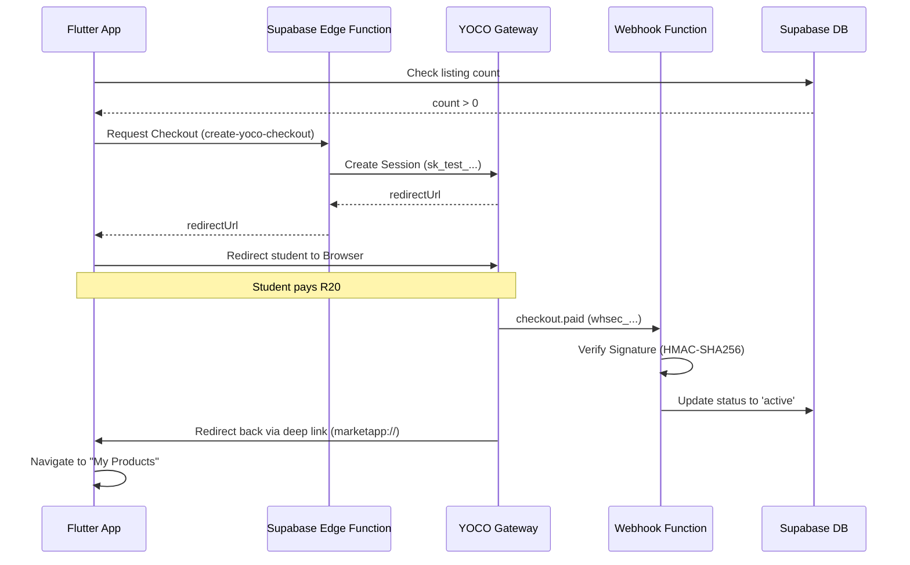

# YOCO Payment Flow: Implementation Summary

This document summarizes the architecture, challenges, and solutions implemented to integrate YOCO payments into the Student Marketplace app.

## 🎯 The Goal
Enforce a freemium monetization model:
- **1st Listing:** Free (Status: `active` immediately).
- **Subsequent Listings:** R20 Fee (Status: `pending_payment` until paid).

---

## 🏗️ Architecture Overview

The flow uses a secure **Server-to-Server** model via Supabase Edge Functions to protect sensitive keys and ensure reliable payment tracking.

---

## 🛠️ Components Implemented

### 1. Edge Functions (Supabase)
- **`create-yoco-checkout`**: Handles the logic of talking to YOCO to generate a payment link. It uses the `YOCO_SECRET_KEY` stored in Supabase Secrets.
- **`yoco-webhook`**: Listens for the `payment.succeeded` event. It verifies the YOCO signature to prevent fraudulent activation and updates the product status in the database.

### 2. Flutter App Logic
- **`PaymentRemoteDataSource`**: Triggers the Edge Function instead of calling YOCO directly.
- **`ProductBloc`**: Coordinates the state transition between creating a product and requiring payment.
- **Deep Linking**: Configured to handle `marketapp://paymentrecieved-callback` to bring the user back into the app after payment.

---

## ⚠️ Problems & Solutions

| Problem | Root Cause | Solution |
| :--- | :--- | :--- |
| **HTML Error on Submit** | YOCO blocks direct API requests from mobile apps for security (WAF/CORS). | Moved the YOCO API call to a **Supabase Edge Function** (server-to-server). |
| **Status 404 Not Found** | Used `online.yoco.com/v1`, which is for data management, not checkouts. | Updated endpoint to `https://payments.yoco.com/api/checkouts`. |
| **"Could not launch URL"** | Android 11+ requires explicit intent declarations in the manifest. | Added `<queries>` and `<intent-filter>` to `AndroidManifest.xml`. |
| **Security Risk** | Storing `sk_...` keys in the app is dangerous. | Used **Supabase Secrets** to store keys; the app only sees the final redirect URL. |
| **Silent Webhook Failures** | Misconfigured secret prefixes (`SUPABASE_` prefix restriction). | Standardized on `YOCO_SECRET_KEY` and `YOCO_WEBHOOK_SECRET` in Supabase vault. |

---

## 🚀 Final Deployment Steps
To maintain this flow, the following must be in place:
1.  **Secrets:** `YOCO_SECRET_KEY` (sk_...) and `YOCO_WEBHOOK_SECRET` (whsec_...) must be set in Supabase.
2.  **Webhook Registration:** The URL `https://[project].supabase.co/functions/v1/yoco-webhook` must be active in the YOCO Dashboard.
3.  **Realtime:** The `products` table must have **Realtime enabled** for the "My Products" page to refresh instantly upon payment.

---
**Status:** ✅ Fully Operational
